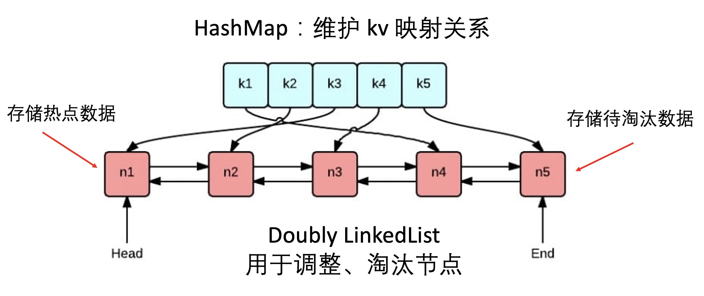
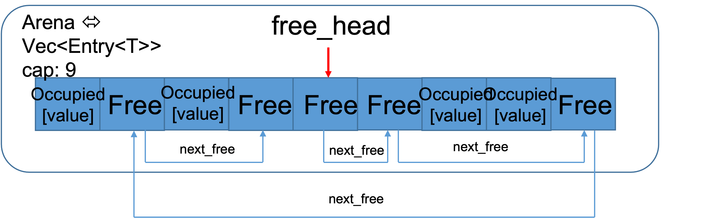
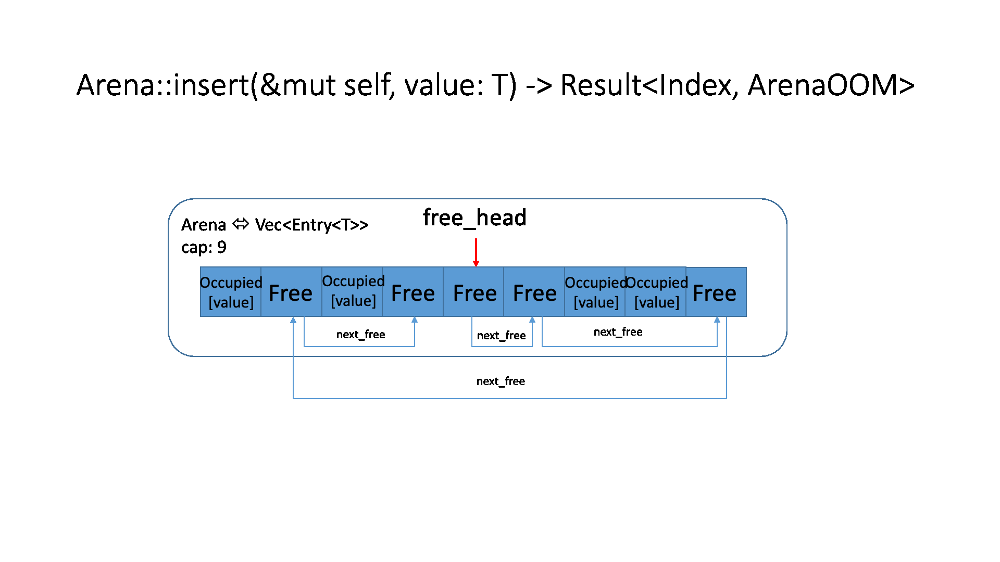
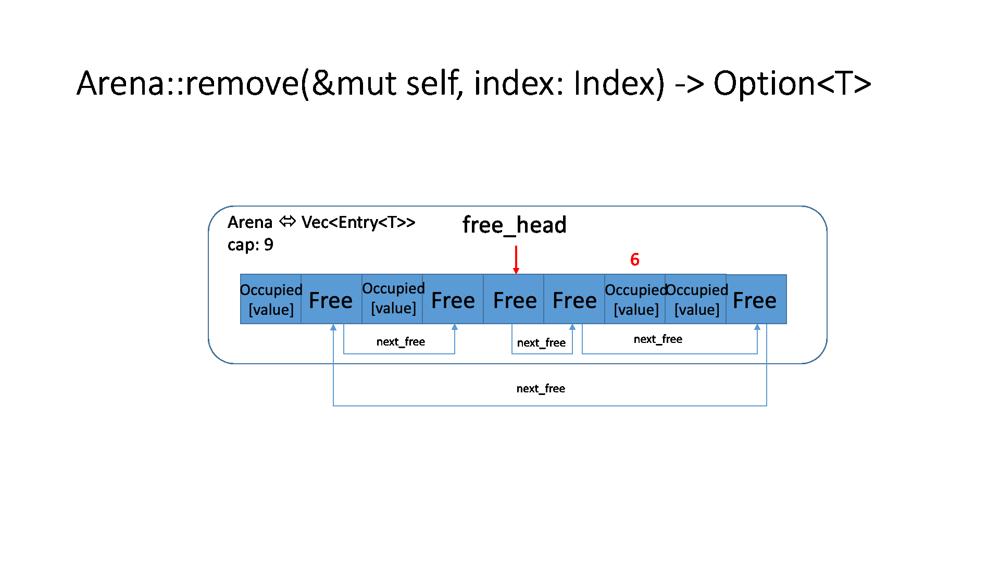
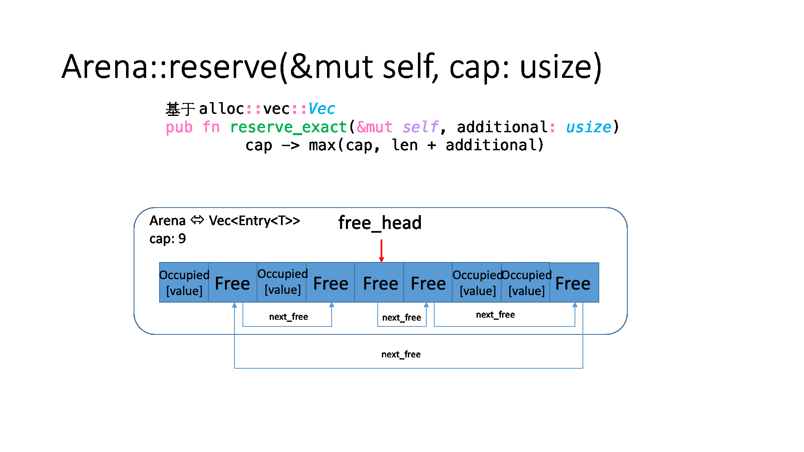

## 基于 Arena 的 LRU 缓存 - Rust 课程大作业

> 参考项目：https://github.com/arindas/generational-lru
> 
> 一个基于 generation 的 lru 实现
> 
> 特点：无 unsafe，无复杂的智能指针，底层通过封装 `Vec` 实现

### 问题分析
- LRU（Least Recently Used）是一种缓存淘汰算法，相较于 FIFO（只基于时间）和 LFU（只基于访问次数）的两种算法，更为折衷。LRU 认为如果数据最近被访问过，那么将来被访问的概率也会更高。
- 实现思路：维护一个队列，如果某条记录被访问了，则移动到队尾，那么队首则是最近最少访问的数据，之后淘汰该条记录即可。
- 需要支持功能：查询（query）、删除（remove）、插入（insert）、超时淘汰（retire）
- 数据结构
  
- Rust 常规实现思路：
	- 基于 `Option<Rc<RefCell<T>>>`，同时要考虑到 HashMap 会引用链表节点、链表节点需要引用 `HashMap` 的 `Key`，实现困难
	- 基于 `unsafe`，直接操作裸指针，类似 C 语言，可能会有内存泄漏问题
- 采用 Arena 的理由：通过封装 Vec，0 智能指针，0 unsafe，容易写、容易理解

### Arena
- Arena 是一种从连续的内存区域分配一组内存对象的方法，可以更好地利用计算机缓存，在 linux 内核、LevelDB 中有广泛应用
- 具体实现：封装 `std::vec::Vec`，采用下标维护节点，在连续的内存区域中模拟插入与删除，空闲区域通过链表串联，可以达到 0 unsafe、0 智能指针
  
- 数据结构定义
  ```rust
  // Arena 中内存块的索引
  pub struct Index {
    // 该内存单位在整个内存区域的下标
    // 这里的下标对应 Vec 中的下标
    idx: usize,

    // 作用是防止 ABA 问题
    // 见：https://github.com/fitzgen/generational-arena
    generation: u64,
  }

  // Arena 中的内存块
  pub enum Entry<T> {
    Free {
        // 下一块空闲区域的下标
        next_free: Option<usize>,
    },
    Occupied {
        // 当前内存中的值
        value: T,
        generation: u64,
    },
  }

  // Arena 主体
  pub struct Arena<T> {
    // 该连续的内存区域中的所有内存单位
    // 通过 Vec 存储，因为 Vec 本身就是一段连续的内存空间
    items: Vec<Entry<T>>,
    // 该连续的内存区域的容量，表明可以容纳 cap 个内存单位
    cap: usize,

    // 当前整个内存区域下一次插入数据时的 generation
    generation: u64,

    // 首个空闲区域的下标（逻辑上）
    // 可能在 Vec 上还有值，但会被覆盖
    free_list_head: Option<usize>,
  }
  ```
  
- 关键方法
  - ```rust
    Arena::insert(&mut self, value: T) -> Result<Index, ArenaOOM>
    ```
    占领内存块中的某一块
    

  - ```rust
    Arena::remove(&mut self, index: Index) -> Option<T>
    ```
    释放内存块中的某一块（变为未被占领状态）
    

  - ```rust
    Arena::reserve(&mut self, cap: usize)
    ```
    在内存块末尾申请额外的连续内存空间
    

### LinkedList
- 链表采用双向链表实现，链表中存储的内容是 `Arena` 内存块中的索引 `Index`，实现的都是常规方法，不多赘述，仅说明一下数据结构定义
- 数据结构定义
  ```rust
  struct Node<T> {
    value: T,
    // 淘汰时间
    // 为空说明没有开启自动超时淘汰机制
    expire_time: Option<time::Instant>,
    next: Option<Index>,
    prev: Option<Index>,
  }

  struct LinkedList<T> {
    arena: Arena<Node<T>>,
    head: Option<Index>,
    tail: Option<Index>,
    len: usize,
    // 每个节点 timeout 的时间
    // timeout 为 None 说明没有开启自动超时淘汰机制
    timeout: Option<time::Duration>,
  }
  ```
- 目前的超时淘汰机制实现较为简单，仅支持整个链表统一设置超时时间，这样超时淘汰的顺序其实就是节点在链表中的排序，所以淘汰只需要从链表尾部开始检查，直到第一个未超时的节点，将中间的都淘汰掉就可以
  ```rust
  // 从链表尾开始淘汰过期节点，并返回其值的所有权的集合
  pub fn retire(&mut self) -> Result<Option<Vec<T>>, ListError> {
    if let Some(_) = self.timeout {
      let now = time::Instant::now();
      let mut values = vec![];
      while !self.is_empty() {
         let tail_index = self.tail.unwrap();
         let expire_time = self.get(&tail_index)?.expire_time.unwrap();
         if now >= expire_time {
            values.push(self.remove(&tail_index)?);
         } else {
            break;
         }
      }
      if values.len() > 0 {
         return Ok(Some(values));
      }
      // 如果没有一个被淘汰，返回 None，而不是 vec![]
    }
    Ok(None)
  }
  ```

### Cache
- 缓存核心部分通过一个 `HashMap` 和 `LinkedList` 完成，并提供了 `query() remove() insert()` 三个供用户操作的方法，同时在 `insert()` 方法中集成了自动淘汰的逻辑
- 数据结构定义
  ```rust
  struct ListItem<K, V> {
    pub key: K,
    pub value: V,
  }

  pub struct Cache<K, V>
  where
    K: Eq + Hash,
  {
    list: LinkedList<ListItem<K, V>>,
     map: HashMap<K, Index>,
  }
  ```
- 使用方法（见 `main.rs`）
   ```rust
   fn main() {
      let mut lru_cache = Cache::<i32, i32>::new_with_cap_timeout(5, time::Duration::from_millis(1000));

      // [1-1]
      lru_cache.insert(1, 1);
      let v = lru_cache.query(&1).unwrap();
      println!("get 1: {v}");
      // [2-2 1-1]
      lru_cache.insert(2, 2);
      let v = lru_cache.query(&2).unwrap();
      println!("get 2: {v}");
      // [3-3 2-2 1-1]
      lru_cache.insert(3, 3);
      let v = lru_cache.query(&3).unwrap();
      println!("get 3: {v}");
      thread::sleep(time::Duration::from_millis(500));

      // [4-4 3-3 2-2 1-1]
      lru_cache.insert(4, 4);
      let v = lru_cache.query(&4).unwrap();
      println!("get 4: {v}");
      // [5-5 4-4 3-3 2-2 1-1]
      lru_cache.insert(5, 5);
      let v = lru_cache.query(&5).unwrap();
      println!("get 5: {v}");

      let len = lru_cache.len();
      println!("current length: {len}");

      let v = lru_cache.query(&6).unwrap_err();
      println!("get 6: {v}");

      // [4-4 3-3 2-2 1-1]
      let v = lru_cache.remove(&5).unwrap();
      println!("remove 5: {v}");
      let v = lru_cache.query(&5).unwrap_err();
      println!("get 5: {v}");

      // [4-4]
      thread::sleep(time::Duration::from_millis(500));
      let len = lru_cache.len();
      println!("current length: {len}");

      // [1-10, 4-4]
      lru_cache.insert(1, 10);
      let len = lru_cache.len();
      println!("current length: {len}");

      let v = lru_cache.query(&4).unwrap();
      println!("get 4: {v}");
      let v = lru_cache.query(&3).unwrap_err();
      println!("get 3: {v}");
      let v = lru_cache.query(&2).unwrap_err();
      println!("get 2: {v}");
      let v = lru_cache.query(&1).unwrap();
      println!("get 1: {v}");
   }

   // output：
   get 1: 1
   get 2: 2
   get 3: 3
   get 4: 4
   get 5: 5
   current length: 5
   get 6: Key not found in cache.
   remove 5: 5
   get 5: Key not found in cache.
   current length: 4
   current length: 2
   get 4: 4
   get 3: Key not found in cache.
   get 2: Key not found in cache.
   get 1: 10
   ```
## 开发过程留档

### 开发流程
- 每个人基于最新的 `master` 建一个自己的分支，根据前面开发的模块进行后续的开发
- 如果前面的人对 api 出入参数有改动，新增函数后面再讨论如何修改
- 每个函数里外最好都写好**中文注释**，解释一下是什么意思，顺便也给自己梳理一下思路
- 最好有测试用例，并且只有测试中用到的方法尽量只写在测试模块中
- 执行 `commit` 之前最好进行一下 `rustfmt` 提高代码可读性
- 开发完 push 到自己的分支后提交 `pull request` 合并到 `master` 分支

### 任务分配
- ✅@裴雷-PeiLeizzz（`arena` 模块 + 部分 `list` 模块 + 部分优化，12.5-12.7）+ 中期汇报 + cache 部分 + README
- ✅@刘书伟-wink301（部分 `list` 模块 + 部分优化(未完成)，12.8-12.12）
- @陈鹏郅-frgg54567 （`lrucache` 模块 + `main` 函数中给出使用示例 + 部分优化，12.13-12.16）

> 结题汇报的时候，可能就 @裴雷 汇报也可能所有人一起，把各自做了什么说一下，如果有优化的话更好，可以详细说一下优化点以及如何做的优化

### 可能的优化点
1. [✅ @裴雷]缓存插入时的自动淘汰：每个节点再维护一个最近活跃时间，插入时如果内存已满本身就要进行淘汰，淘汰完可以再检查下链表尾的节点是否有超时，如果有的话，就一直往前删直到链表为空或者遇到第一个没超时的节点，这样就实现了时间 + 空间的双淘汰制度
   > 目前仅实现对链表统一设置过期时长的自动淘汰
   >
   > TODO: 要实现每个节点单独的过期时长（需要以第 2 点为基础）
   >
   > 因为如果每个节点有单独的过期时长，那么每次检查过期都需要遍历整个链表，代价太大，不适合放在用户操作时进行，只能通过异步 / 后台线程的形式进行
2. [ @刘书伟]用户操作时的自动淘汰：类似于第 1 点，但是用户的操作优先级更高，最好不要等删完了再返回，是否可以做一个**异步**的操作？先响应操作，然后后台异步淘汰超时的数据，或者通过**后台线程**轮询来实现
   > 抛砖引玉：采用定时线程可能的思路：在 `LRUCache` 模块封装 `LinkedList` 的时候，用 `Arc<>` 包裹，然后挂载一个 `static thread` 让它每隔一段时间执行
   > 
   > `LRUCache` 销毁的时候需要销毁该线程
   >
   > 难点在于 `&mut` 的争夺，在正常 `query / remove / insert` 的时候，能否暂停线程？等操作执行完再继续
   >
   > 应该让线程和 `LinkedList` 的同级而不是放在 `LinkedList` 内部，因为需要将删除的元素返回出来，再在 `Map` 中将其删除
   > 
   > 可以参考 [https://stackoverflow.com/questions/42043823/design-help-threading-within-a-struct](https://stackoverflow.com/questions/42043823/design-help-threading-within-a-struct)
3. [ @刘书伟]（尝试）并发安全的缓存？通过 Rust 的锁是否可以不改动内部代码就实现？
   > 个人感觉应该是可以直接支持并发的，否则 generation 没有应用场景
   >
   > 但这个并发应该也是作用于 `LRUCache` 的操作中而不是 `LinkedList` 的操作中，因为 `Map` 也需要并发安全
   >
   > `Map` 的并发安全可以基于 [DashMap](https://docs.rs/dashmap/3.11.10/dashmap/struct.DashMap.html)
4. [ @陈鹏郅]优化实现 LRU-K / 2Q
   > LRU-K 是通过 `2` 个 `LRUCache` 实现的（可能比较麻烦）
   > 
   > 2Q 是通过 `LRUCache + FIFO` 实现的（较容易）
   >
   > 可以参考 [https://segmentfault.com/a/1190000022558044](https://segmentfault.com/a/1190000022558044) 中的描述，2Q 应该不难
5. [ @陈鹏郅]是否可以在 cache 中加一个回调函数？当查询 miss 的时候，通过这个回调函数去另外的地方再找（例如数据库、文件等），如果还找不到才是真正的 miss
   > 类似于 [这里](https://geektutu.com/post/geecache-day2.html#3-1-%E5%9B%9E%E8%B0%83-Getter) 的实现
